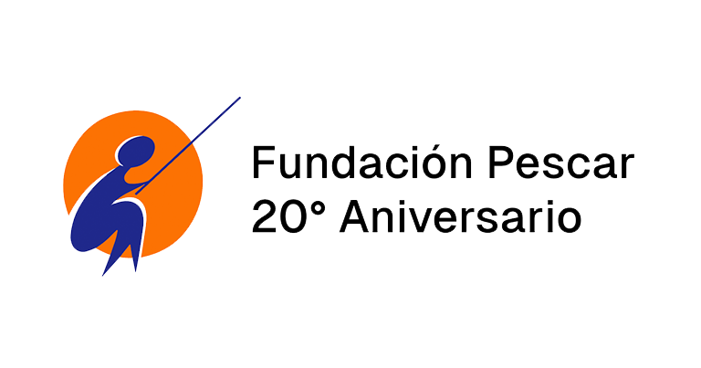

# Proyecto Pescar 20 Años

## Web creada para la celebración por los 20 años de la Fundación Pescar

### Contenido
- Landing con fotos de distintas sedes de la Fundación
- Juegos ( MemoTest y Trivia )
- Pagina de los desarrolladores
- Pagina de emprendimientos de egresados
- Pagina de testimonios de egresados

### Hecho con:

### Desarrolladores:

Brian Pumarica [@brianpumarica](https://github.com/brianpumarica)

Rodrigo Cabrera [@Rodrigo-Emca](https://github.com/Rodrigo-Emca)

Martin Virun [@martinvirun](https://github.com/martinvirun)

Tadeo Abbruzzese [@tadeoabbruzzese](https://github.com/tadeoabbruzzese)

Maximiliano Dorado [@6bos](https://github.com/6bos)

Alexander Mamani [@alexqs96](https://github.com/alexqs96)